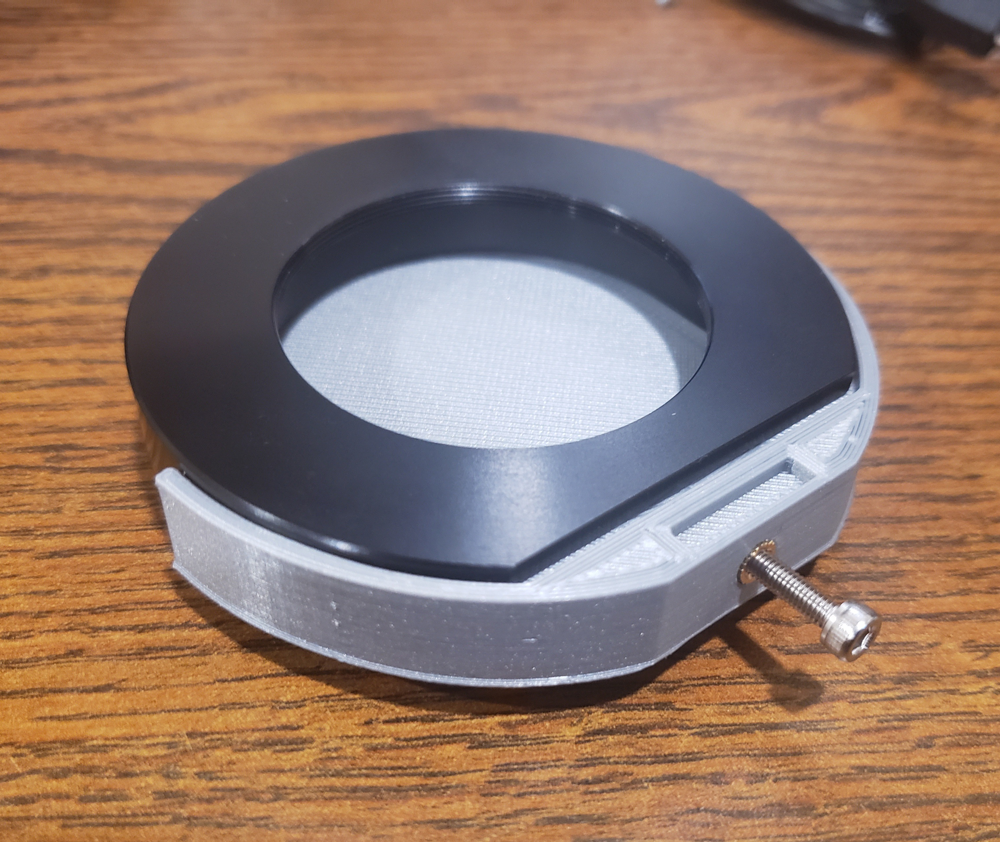

<!-- PROJECT SHIELDS -->
<!--
*** I'm using markdown "reference style" links for readability.
*** Reference links are enclosed in brackets [ ] instead of parentheses ( ).
*** See the bottom of this document for the declaration of the reference variables
*** for contributors-url, forks-url, etc. This is an optional, concise syntax you may use.
*** https://www.markdownguide.org/basic-syntax/#reference-style-links
-->
[![Contributors][contributors-shield]][contributors-url]
[![Forks][forks-shield]][forks-url]
[![Stargazers][stars-shield]][stars-url]
[![MIT License][license-shield]][license-url]

<!-- PROJECT LOGO -->
 

  

  <h3 align="center">Simple Starizona Filter Drawer Compatible Dark Filter</h3>

  

    A simple project to make dark frames way easier. :telescope: 
  

<!-- TABLE OF CONTENTS -->

  
<h2 style="display: inline-block">Table of Contents</h2>

  <ol>
    <li>
      <a href="#about-the-project">About The Project</a>
      <ul>
        <li><a href="#built-with">Built With</a></li>
      </ul>
    </li>
    <li><a href="#design">Design</a></li>
    <li><a href="#license">License</a></li>
    <li><a href="#contact">Contact</a></li>
    <li><a href="#acknowledgements">Acknowledgements</a></li>
  </ol>

<!-- ABOUT THE PROJECT -->
## About The Project

The RASA telescope design presents both advantages and disadvantages. One of the most notable is that you can't install a filter wheel into your lightpath! The Starizona filter drawer solved my filter issue quite nicely. Another issue is that you can't take dark frames by mounting the telescope cover, because your camera is in the way. Rather than shell out the money for a nice dark filter, *and having to monkey with unscrewing one of my precious filters from the expensive filter drawer, *I instead opted to design and print my own dark filter. My Ender 3 isn't perfect optical quality, but in this case I don't think it will be an issue.

### Built With

* [M3 Heat Set Inserts](https://www.amazon.com/dp/B07D683Q26?ref=ppx_yo2_dt_b_product_details&th=1)
* [6mm Neodymium Magnets](https://www.amazon.com/gp/product/B077K364Z7/ref=ppx_yo_dt_b_search_asin_title?ie=UTF8&psc=1)

<!-- DESIGN DESCRIPTION -->
## Design

The dark filter simply blocks all incoming light from entering the camera. I suggest using black plastic to help absorb light; the black plastic didn't showcase the filter very well when I needed to take pictures of it. 

There are two small holes in the back side of the filter, where you can optionally glue into place a pair of 6mm neodymium magnets. Make absolutely sure that they are aligned properly with your filter drawer BEFORE glueing them into place, or they will repel the magnets in the filter drawer. 

There is enough room to grab the filter drawer with your fingers if you have small hands, but I really don't like presenting opportunities to touch the corrective plate on my RASA. Instead, you can install a small M3 heat set insert on the front face of the filter. If you are not used to heat set inserts, [Hackaday] (https://hackaday.com/2019/02/28/threading-3d-printed-parts-how-to-use-heat-set-inserts/) wrote a great article on using them. Then, you can install any size M3 bolt, or make your own nice knob to match the other filters. 

<!-- LICENSE -->
## License

Distributed under the MIT License. See `LICENSE` for more information.

<!-- CONTACT -->
## Contact

Liam Plybon - lplybon1@gmail.com

Project Link: [https://github.com/blablabliam/StarizonaDarkFilter](https://github.com/blablabliam/StarizonaDarkFilter)

<!-- ACKNOWLEDGEMENTS -->
## Acknowledgements

* [Starizona](https://starizona.com/)

<!-- MARKDOWN LINKS & IMAGES -->
<!-- https://www.markdownguide.org/basic-syntax/#reference-style-links -->
[contributors-shield]: https://img.shields.io/github/contributors/blablabliam/StarizonaDarkFilter.svg?style=for-the-badge
[contributors-url]: https://github.com/blablabliam/StarizonaDarkFilter/graphs/contributors
[forks-shield]: https://img.shields.io/github/forks/blablabliam/StarizonaDarkFilter.svg?style=for-the-badge
[forks-url]: https://github.com/blablabliam/StarizonaDarkFilter/network/members
[stars-shield]: https://img.shields.io/github/stars/blablabliam/StarizonaDarkFilter.svg?style=for-the-badge
[stars-url]: https://github.com/blablabliam/StarizonaDarkFilter/stargazers
[issues-shield]: https://img.shields.io/github/issues/blablabliam/StarizonaDarkFilter.svg?style=for-the-badge
[issues-url]: https://github.com/blablabliam/StarizonaDarkFilter/issues
[license-shield]: https://img.shields.io/github/license/blablabliam/StarizonaDarkFilter.svg?style=for-the-badge
[license-url]: https://github.com/blablabliam/StarizonaDarkFilter/blob/master/LICENSE.txt
